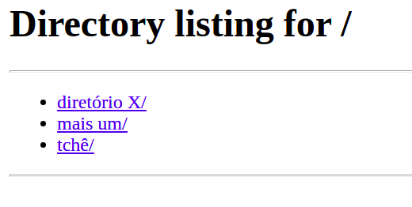

# Experimento 2.4.2

1. Criando diretório e arquivo index.html
mkdir -p std2/www && cd std2
echo "<html><h1>Sistemas Distribuidos</h1></html>" > www/index.html

2. Criando arquivo Dockerfile
## usando uma imagem do python3.9 sobre o linux Alpine
FROM python:3.10-alpine
## Diretório de trabalho para os comandos RUN, CMD, COPY, ADD, ENTRYPOINT
WORKDIR /www
## Porta que será exposta ao host
EXPOSE 80
## Comando que será executado durante o 'docker run'
CMD ["python3", "-m", "http.server", "80"]

3. Gerando a imagem a partir do Dockerfile
docker build -t stdwebserver .

4. Executando um contêiner a partir da imagem criada, fazendo mapeamento do diretório local 1
www para um um diretório www dentro contêiner e o redirecionamento da porta 8000 do host
para a porta 80 do contêiner. O parâmetro -d inicia o contêiner no modo detached 2
docker run -v `pwd`/www:/www -dp 8000:80 --rm --name web stdwebserver

5. Abra o navegador web e aponte para a URL: http://localhost:8000

6. Interrompa a execução do contêiner com o comando: docker stop web

# Resultado do experimento:

Rodando o container, ele gera um listador de diretórios web:

